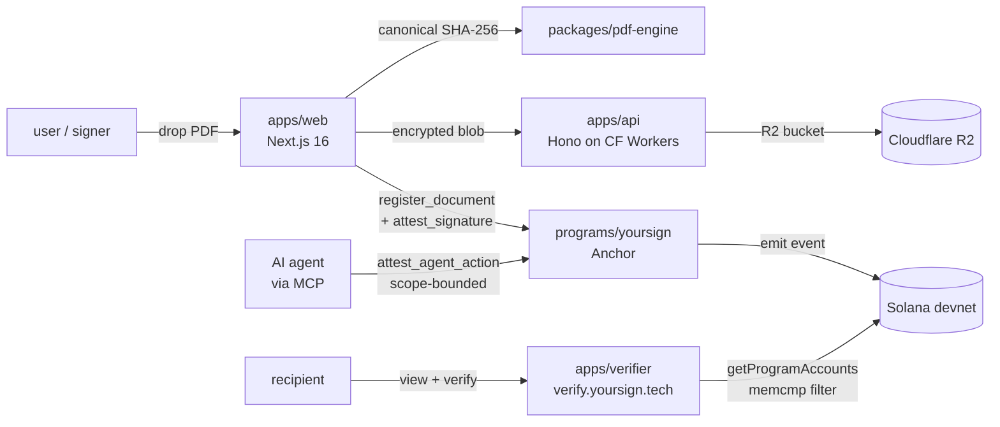

<div align="center">

# YourSign

**Decentralized document signing on Solana — multi-party, on-chain, with cryptographically scoped AI agent delegation.**

[](LICENSE)
[](https://solana.com)
[](https://anchor-lang.com)
[](https://workers.cloudflare.com)
[](https://nextjs.org)
[](https://arena.colosseum.org/projects/explore/yoursign)
[](https://yoursign.tech)

[**Live demo →**](https://yoursign.tech) · [**Public verifier →**](https://verify.yoursign.tech) · [**Vote on Colosseum →**](https://arena.colosseum.org/projects/explore/yoursign)

</div>

---

## TL;DR

Drop a PDF, anchor its SHA-256 hash on Solana, invite signers via a shared link, watch the on-chain status flip from `Awaiting → Partial → Completed`. Each signature is its own on-chain account, cryptographically bound to the signer's keypair. AI agents can sign on your behalf with scope-bounded, revocable, on-chain delegations (ADR-0007).

No backend in the verification path. Sub-cent fees per signature.

## What makes it different

| | DocuSign / Adobe Sign | DocuSeal | **YourSign** |
|---|---|---|---|
| Data custody | vendor servers | self-hosted server | **client-side, on-chain hash** |
| Signature proof | vendor audit trail | DB row | **on-chain account, ed25519** |
| Fee | $0.50 – $40/sig | infra cost | **~$0.001 SOL + flat USDC fee** |
| AI agent signing | not supported | not supported | **scoped + revocable on-chain (ADR-0007)** |
| Verification | vendor portal | self-hosted | **public RPC, no backend** |
| Multi-party | yes | yes | **yes, each sig = on-chain account** |
| Open source | no | yes (AGPL) | **yes (Apache-2.0)** |

## Try it

```text
1. Open https://yoursign.tech
2. Drop any PDF (≤25 MB)
3. Pick required signers (1–10)
4. Connect wallet (Phantom / Backpack / Privy email login)
5. Click "Anchor hash on-chain" — owner self-signs in the same tx
6. Copy /sign/<hash> URL → send to next signer
7. Status flips to Completed once threshold met
8. Verify any time at https://verify.yoursign.tech
```

## Architecture



## Stack

| Layer | Choice |
|---|---|
| **On-chain** | Anchor 0.30.1 program · Solana devnet · `35Rb…M8X` |
| **Web** | Next.js 16 App Router · `next-intl` (EN/PT) · Privy embedded wallets · Solana Wallet Adapter |
| **API / blob** | Hono on Cloudflare Workers · R2 (object) · KV (sessions) |
| **Verifier** | Next.js 16 read-only · queries Solana RPC directly · zero backend in path |
| **MCP server** | `apps/mcp` exposes `delegate`, `sign_document`, `verify`, `revoke` tools |
| **PDF** | `packages/pdf-engine` canonical SHA-256 + structural normalization |
| **Crypto** | `packages/crypto` ed25519 / X25519 envelope (planned) |
| **Build** | pnpm + turborepo · Node 24 LTS · TypeScript strict |

## Repo layout

```
core/
├── apps/
│   ├── web/        # /sign /agents /d/[id] flows + i18n EN/PT
│   ├── verifier/   # verify.yoursign.tech read-only PDF check
│   ├── api/        # Hono API + R2 blob endpoint
│   ├── worker/     # queue consumer scaffold
│   └── mcp/        # Model Context Protocol server for AI agents
├── packages/
│   ├── solana-sdk/ # hand-encoded ix builders + PDA helpers
│   ├── pdf-engine/ # canonical hash + field detection
│   ├── crypto/     # ed25519 / X25519 envelope helpers
│   ├── agent-sdk/  # canonical agent delegation messages
│   ├── ui/         # shared components
│   └── schemas/    # zod DTOs
├── programs/
│   └── yoursign/   # Anchor program — register_document, attest_signature
└── docs/           # spec, ADRs, contracts, sequences
```

## On-chain program

| Instruction | Purpose |
|---|---|
| `register_document` | Anchors a doc — creates `DocumentRegistry` PDA `[b"doc", document_id]` |
| `attest_signature` | Each signer attests once — creates `SignatureAttestation` PDA `[b"sig", document_id, signer]`, increments `completed_signers`, flips status to `Completed` when threshold met |

Detailed contract: [`docs/contracts/on-chain-program.md`](docs/contracts/on-chain-program.md). Decision records under [`docs/adr/`](docs/adr/).

## Spec-driven

No code lands without a falsifiable spec. See [`docs/01-spec.md`](docs/01-spec.md) and the [ADR set](docs/adr/). Sequence diagrams in [`docs/sequences/`](docs/sequences/).

## Status

Devnet live. Multi-party signing flow shipping at [yoursign.tech](https://yoursign.tech). Pre-mainnet deploy gated by 3-of-5 multisig handover (ADR-0002).

## License

Apache-2.0. Public from day 1 — Colosseum requirement and a feature, not a tax.

## Links

- Live: [yoursign.tech](https://yoursign.tech) · [verify.yoursign.tech](https://verify.yoursign.tech)
- Colosseum: [arena.colosseum.org/projects/explore/yoursign](https://arena.colosseum.org/projects/explore/yoursign)
- Solana program: [explorer.solana.com/address/35Rb…M8X?cluster=devnet](https://explorer.solana.com/address/35RbwNgx9Em28mMLZ6iWzjCnaTd4tD2NWuxrHqR76M8X?cluster=devnet)
