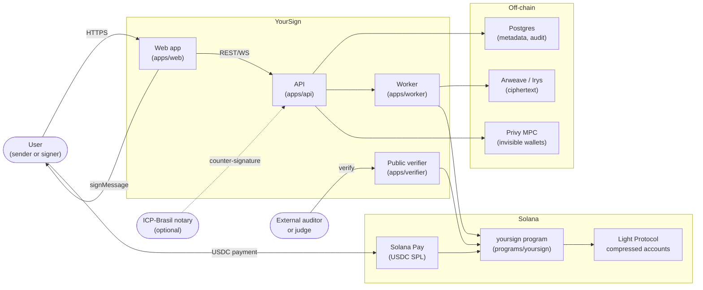
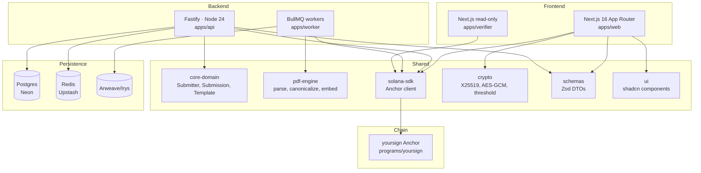
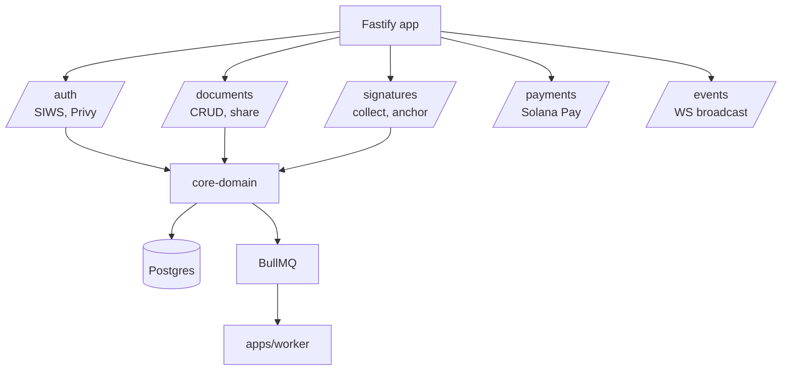
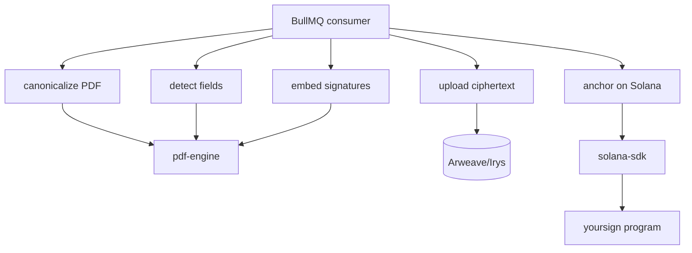
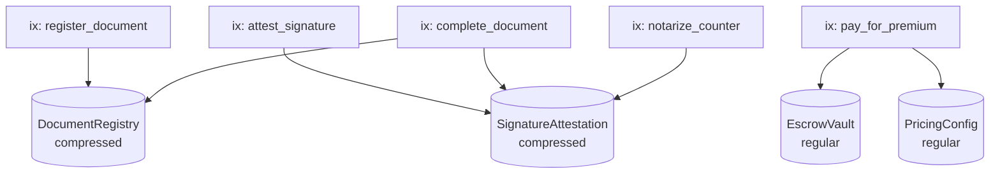
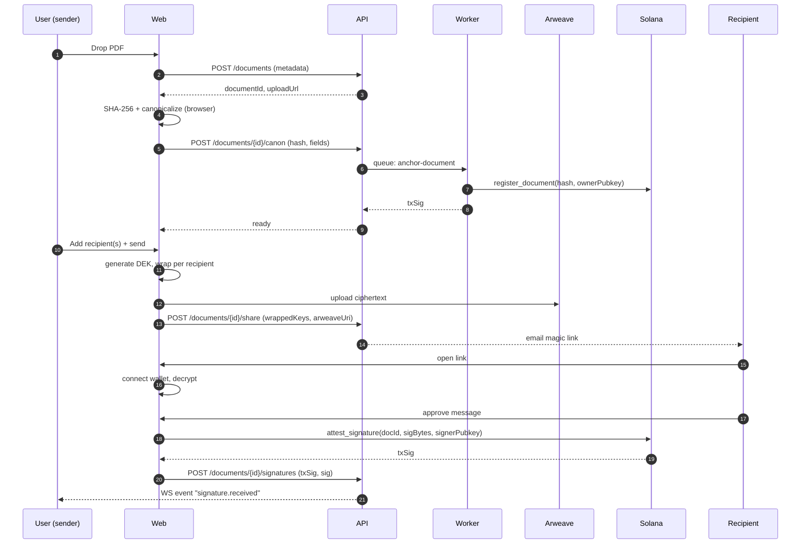

# 02 — Architecture

This is the **HOW** companion to `01-spec.md`. Diagrams in Mermaid (GitHub-renderable). Component boundaries match workspace boundaries — if you can't point to a folder, the component shouldn't exist.

## C1 — System context



## C2 — Container view



## C3 — Component view (per app)

### `apps/web`

```mermaid
graph TB
  routes[App Router<br/>app/]
  routes --> landing[/Landing<br/>app/(public)/page.tsx/]
  routes --> editor[/Editor<br/>app/(app)/d/[id]/page.tsx/]
  routes --> dashboard[/Dashboard<br/>app/(app)/page.tsx/]
  routes --> signFlow[/Sign flow<br/>app/(public)/sign/[token]/page.tsx/]

  signFlow --> walletAdapter[Wallet Adapter]
  signFlow --> privy[Privy SDK]
  editor --> pdfViewer[PDF.js viewer]
  editor --> fieldEditor[Field overlay editor]

  walletAdapter --> sdk[solana-sdk]
  privy --> sdk
  sdk --> rpc[Solana RPC]
```

### `apps/api`



### `apps/worker`



### `programs/yoursign` (Anchor)



## Data flow — happy path



## Cross-cutting concerns

- **Observability.** OpenTelemetry from `apps/api` + `apps/worker` → Datadog (or Vercel observability). One trace per document lifecycle.
- **Auth.** SIWS (Sign-In with Solana) for the platform; Privy session JWTs accepted as a delegate for embedded wallets. (See ADR-0006.)
- **Rate limits.** Per-pubkey, per-IP. Free tier capped at 5 multi-party docs/month.
- **Data residency.** Arweave is global; Postgres lives in `gru1` (São Paulo) for LGPD friendliness.
- **Failure modes.** Solana RPC down → retry with exponential backoff (BullMQ). Arweave bundler down → fall back to S3 with a "pending finality" badge.

## What we deliberately don't have

- **No microservice gateway.** One Fastify app. One worker process. We split when load demands.
- **No GraphQL.** REST + WS. Schemas owned by `packages/schemas`.
- **No Kubernetes.** Vercel Functions + a single long-running worker on Fly/Railway.
- **No on-chain frontend state.** Solana stores attestations only. Display layer is web.
