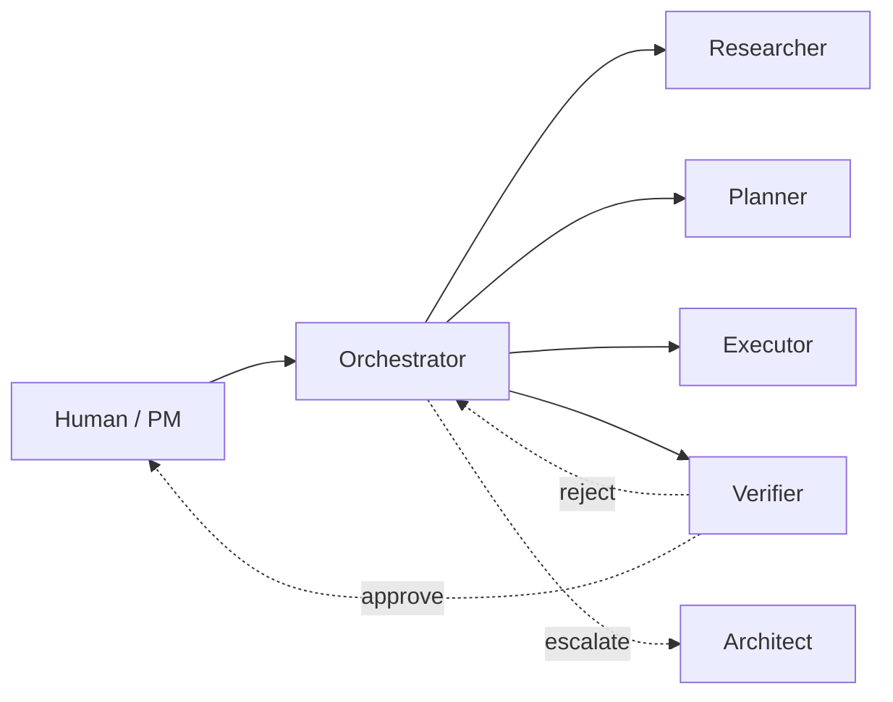

# 03 — Symphony Harness

> Inspired by how OpenAI's research engineering teams build with autonomous agents: a small, opinionated **harness** that orchestrates specialist roles against a shared spec, with verification as a first-class loop.

## What "harness" means here

A harness is **the scaffolding around the model**, not the model itself. It defines:

1. **Roles** — narrow agents with bounded responsibility.
2. **Contracts** — what each role consumes (spec refs, prompts) and produces (diffs, reports).
3. **Loops** — the orchestrator → specialist → verifier cycle.
4. **State** — what's logged, what's gitignored, what's part of the public artifact.

We name it **Symphony** because the orchestrator is a conductor, not a soloist: it doesn't generate code, it sequences the specialists who do.

## The five roles



| Role | Tools | Input | Output | Lives in |
| ---- | ----- | ----- | ------ | -------- |
| Orchestrator | Skill, Task, Bash | A feature brief | Sequenced calls + final summary | `harness/orchestrator.md` |
| Researcher | WebSearch, WebFetch, Read | A research question | A `harness/runs/research-*.md` brief | `harness/prompts/researcher.md` |
| Planner | Read, Grep, Write | Spec + research brief | A `tasks/<phase>.md` task list with ACs | `harness/prompts/planner.md` |
| Executor | Read, Edit, Write, Bash | One task with ACs | Code diff + commit | `harness/prompts/executor.md` |
| Verifier | Read, Grep, Bash | A diff + ACs | Pass/fail report | `harness/verifiers/*.md` |
| Architect | Read, Write | An open question | An ADR draft | `harness/prompts/architect.md` |

Concrete agents available right now:

- **Claude Code skills** — `bp:execute-prp`, `gsd-spec-phase`, `gsd-plan-phase`, `gsd-execute-phase`, `gsd-code-review`, `gsd-code-review-fix`, `gsd-verify-work`.
- **External experts** via the delegator MCP — `mcp__codex__codex`, `mcp__gemini__gemini`. Use Gemini Pro for security/architecture, Codex for tight code reviews. (See `~/.claude/rules/delegator/`.)

## The five loops

### Loop 1 — Spec → Plan → Execute (`gsd` flow)

```
gsd-spec-phase   → docs/01-spec.md updated, ACs added
gsd-plan-phase   → docs/tasks/<phase>.md generated, verifier loop runs
gsd-execute-phase → wave-based execution, atomic commits
gsd-code-review  → verifier on the diff
```

### Loop 2 — TDD-E2E (`bp:execute-prp`)

```
bp:generate-prp   → docs/prds/<feature>.md
bp:execute-prp    → red → green → refactor with E2E tests as gate
```

### Loop 3 — Verifier dialectic

The verifier is **always a different agent than the executor**. Defaults:

- Executor: Claude Sonnet 4.6 or Opus 4.7.
- Verifier: Gemini 2.5 Pro (independent perspective) or Codex GPT-5.3.
- Architect arbitration: Opus 4.7 with extended thinking.

A failed verifier pass triggers re-execution with the verifier's report appended.

### Loop 4 — Pre-flight delegation

For high-stakes work (auth, crypto, on-chain), the orchestrator MUST delegate to the Security Analyst (`prompts/security-analyst.md`, Gemini 2.5 Pro) before merging. Threshold: any change touching `packages/crypto`, `programs/yoursign`, or `apps/api/auth/*`.

### Loop 5 — Public-narrative loop

After every milestone:

1. `gsd-extract_learnings` → `docs/learnings/<phase>.md`.
2. `gsd-milestone-summary` → `docs/milestones/<n>.md`.
3. Hackathon submission narrative is **assembled from these artifacts**, not retrofitted.

## State & determinism

- **Prompts versioned** in `harness/prompts/` and `harness/verifiers/`.
- **Run logs** in `harness/runs/` (gitignored). Each run logs: model, params, prompt hash, spec refs consumed, diff summary.
- **Evals** in `harness/evals/` (committed) — a small golden set per critical loop (e.g., "does the executor stay in scope when given a single AC?").

## When a human steps in

The harness escalates to a human when:

1. Two consecutive verifier passes fail with conflicting reports.
2. An executor reports `STOP: spec ambiguity` referencing a missing AC.
3. A change requires a new ADR but the architect role hasn't been invoked.
4. Anything touches user funds, key custody, or production secrets.

## Why this works for the hackathon

- **Narrative legibility.** Judges can replay our reasoning by reading `docs/` + `harness/runs/`.
- **Reproducibility.** A new contributor can re-run a milestone with `gsd-execute-phase` and get a comparable diff.
- **Speed.** Specialists run in parallel. The orchestrator amortizes the human cost of context switching.
- **Honesty.** We log when an agent fails and how we recovered. That's a feature, not a bug — Colosseum judges have seen 100 demos that *say* they used AI; we *show* it.

## Anti-patterns

- ❌ Letting the executor write specs (executor stays in scope).
- ❌ Letting the orchestrator write code (orchestrator only sequences).
- ❌ Skipping the verifier when "it's a small change."
- ❌ Hardcoding model names in prompts (use `harness/config.yaml`).
- ❌ Committing `harness/runs/` (privacy + noise).
