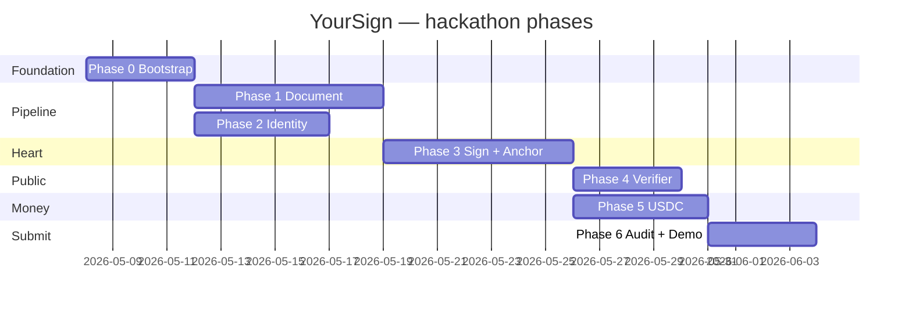

# 04 — Roadmap

Time-bounded by the [Colosseum hackathon](https://arena.colosseum.org/hackathon). Phases are concurrent where dependencies allow.

## Phase 0 — Bootstrap (week 0)

**Goal.** Repo, specs, harness, and CI are live.

- [x] `core/` monorepo skeleton.
- [x] Spec, architecture, harness docs.
- [ ] CI: GitHub Actions running typecheck + lint + Anchor build.
- [ ] Vercel project linked for `apps/web` + `apps/verifier`.
- [ ] Postgres (Neon) + Redis (Upstash) + Arweave bundler keys provisioned.
- [ ] `harness/orchestrator.md` runnable end-to-end on a toy feature.

**Exit criteria.** A new contributor can `pnpm install && pnpm dev` and see a live (empty) app.

## Phase 1 — Document pipeline (week 1)

**Goal.** Upload → canonical hash → field detection works end-to-end without signing yet.

- AC-1.1.* through AC-1.3.* in spec.
- `packages/pdf-engine` shipped with test fixtures.
- `apps/web` Landing + Editor screens live (port from prototype).
- `apps/api` accepts uploads, queues canonicalization.

**Exit.** Drop a PDF, see auto-detected fields, confirm canonical hash matches across browsers.

## Phase 2 — Identity & wallet (week 1.5)

**Goal.** A user can connect/create a wallet and authenticate with SIWS.

- AC-2.* in spec.
- `packages/solana-sdk` ships wallet-adapter integration + Privy.
- `apps/api` issues SIWS sessions.

**Exit.** Login with Phantom AND with email-via-Privy on the deployed Vercel preview.

## Phase 3 — Encryption + sign + anchor (week 2 — the heart)

**Goal.** End-to-end signing flow with on-chain attestation.

- AC-3.* and AC-4.* in spec.
- `programs/yoursign` deployed to devnet.
- `packages/crypto` with X25519 + AES-GCM + audited tests.
- Worker anchors via Light Protocol.

**Exit.** Two-party signing flow: sender invites recipient, recipient signs, attestation visible on Solana Explorer, completed PDF downloadable with audit appendix.

## Phase 4 — Verifier site + CLI (week 2.5)

**Goal.** Anyone can verify without our backend.

- AC-5.* in spec.
- `apps/verifier` deployed at a separate Vercel domain.
- `solana-sdk` CLI ships.

**Exit.** Drop a signed PDF on `verify.yoursign.tech`, see the on-chain proof.

## Phase 5 — USDC payments (week 3)

**Goal.** Premium tier unlocks via Solana Pay.

- AC-6.* in spec.
- Solana Pay transaction request endpoint live.
- One paid feature wired (notarization stub).

**Exit.** Pay $1 USDC, get a notarized counter-signature on a document.

## Phase 6 — Audit + polish + demo (week 3.5)

**Goal.** Hackathon submission ready.

- AC-7.* in spec.
- Demo script + 2-min video.
- `docs/milestones/hackathon-submission.md` finalized.
- Performance budget AC-8.* met.

**Exit.** Submission posted on Colosseum portal.

## Stretch (post-hackathon, post-MVP)

- Bulk template engine (DocuSeal parity).
- Mobile PWA with biometric unlock.
- ICP-Brasil real notary integration.
- DOCX ingestion.
- ER-based live co-signing (MagicBlock).
- Compressed account migration tooling.

## How phases interlock

## Risk register (high level)

| Risk | Mitigation |
| ---- | ---------- |
| Light Protocol RPC instability | Fall back to mainnet uncompressed account; metric-watch. |
| PDF canonicalization corner cases | Ship fixture corpus + property-based tests early in Phase 1. |
| Privy MPC integration friction | Have wallet-adapter as a working baseline before adding Privy. |
| USDC compliance in Brazil | Stay clear of FX rails; receive USDC as "service fee" not as remittance. |
| Hackathon scope creep | Spec is the law. Anything not in `01-spec.md` is post-MVP. |
