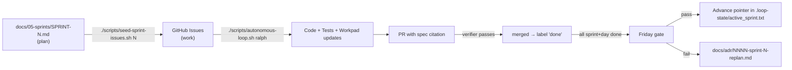

# Sprints

Five sprints, each 4–5 days, Google Design Sprint cadence (Understand → Diverge → Decide → Prototype → Validate). One Friday gate per sprint. Failing the gate = ADR + replan, never silent skip.

## Map to roadmap phases

| Sprint | Roadmap phase | Spec sections hit | Gate |
|--------|---------------|-------------------|------|
| [SPRINT-0](./SPRINT-0.md) | Phase 0 (Bootstrap) | foundation only | All stub apps boot, anchor builds, verifiers operational |
| [SPRINT-1](./SPRINT-1.md) | Phase 1 + 2 (Doc pipeline + Identity) | §1, §2 | Same PDF → same hash; Phantom + Privy login both work |
| [SPRINT-2](./SPRINT-2.md) | Phase 3 (Encryption + Sign + Anchor) | §3, §4 | 2-party signing on devnet; cost p99 ≤$0.001; server holds no plaintext |
| [SPRINT-3](./SPRINT-3.md) | Phase 4 + 5 (Verifier + USDC) | §5, §6 | Verify w/o backend; pay 1 USDC → notarize counter-sig |
| [SPRINT-4](./SPRINT-4.md) | Phase 6 (Audit + Demo) | §7, §8 | Submission posted to Colosseum |

Total: ~24 working days inside the hackathon window. Buffer = Phase 6 lasts 4 days then submit.

## How sprints become work

## How to add a new sprint

1. Write `SPRINT-N.md` following the existing format (Mon/Tue/Wed/Thu/Fri sections, Friday gate).
2. Add a case branch to `scripts/seed-sprint-issues.sh` for sprint N.
3. Run the seeder.
4. Optional: extend `scripts/autonomous-loop.sh` `advance_sprint_if_complete()` for the new pointer.
