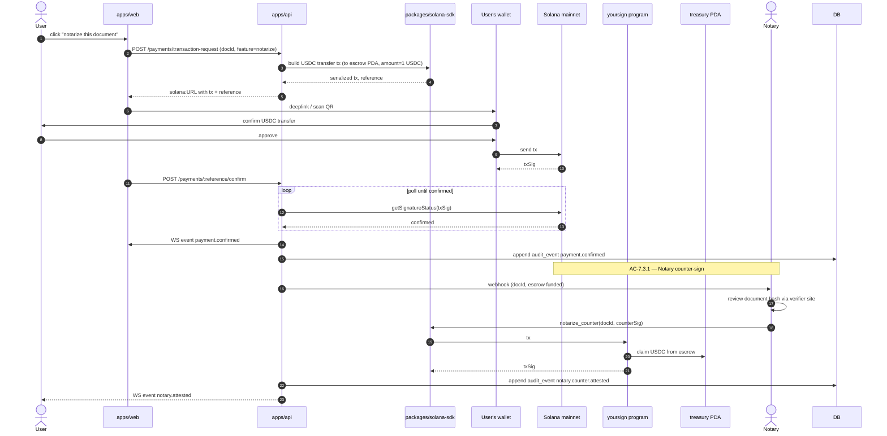

# Sequence — Premium feature payment via Solana Pay (USDC)

References AC-6.* in `docs/01-spec.md`.

## Why we use a transaction request (not a transfer request)

A Solana Pay **transaction request** lets our server inject metadata into the tx (the `reference` pubkey, the document ID via `memo`). This binds the payment to the document on-chain, so anyone can later prove "this payment is for that document" without trusting our DB.
