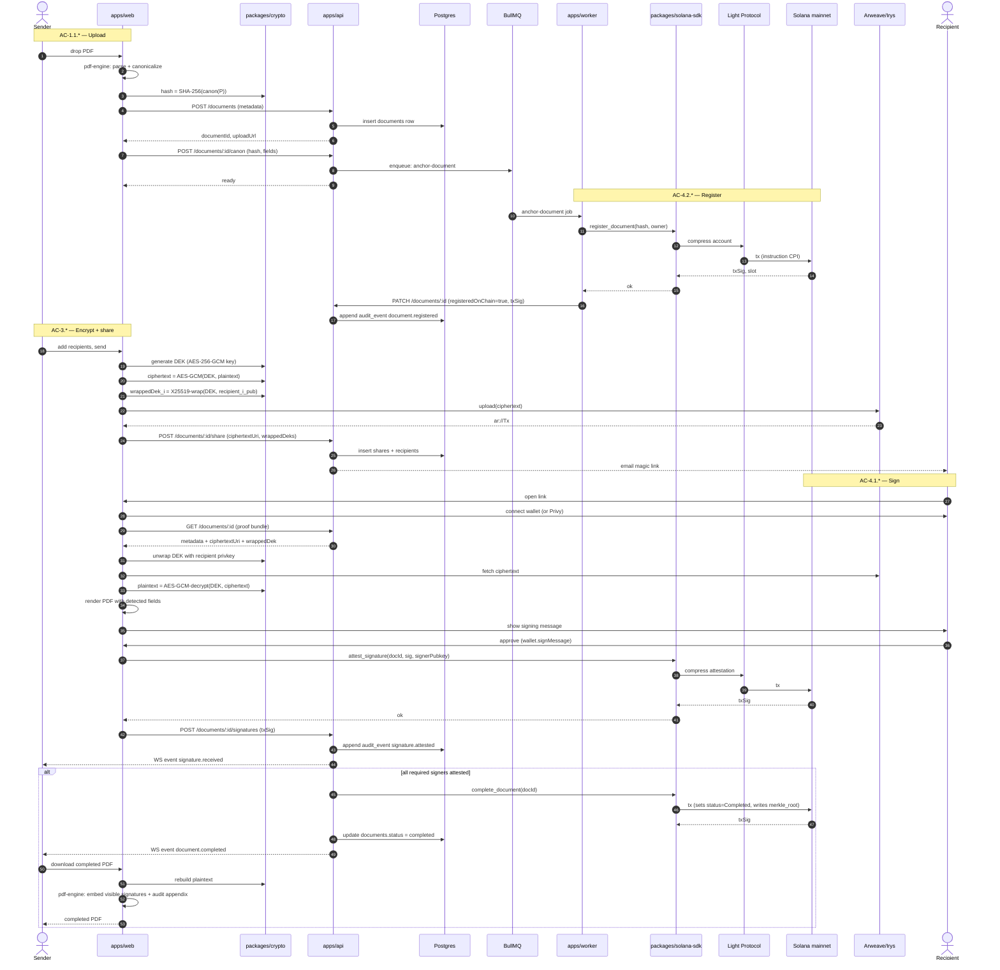

# Sequence — End-to-end signing flow

The "happy path" from upload to anchored attestation. References AC-1.* through AC-4.* in `docs/01-spec.md`.

## Why this sequence is interesting (for judges)

- **Worker never decrypts.** The worker handles registration and anchoring of *hashes only*. AC-3.* is preserved.
- **Anchoring uses ZK Compression.** Each `attest_signature` is a compressed-account write — that's the cost story.
- **Verifier path is symmetric.** The third-party verifier replays steps 24–27 (without the wallet handshake) using only the public proof bundle.
