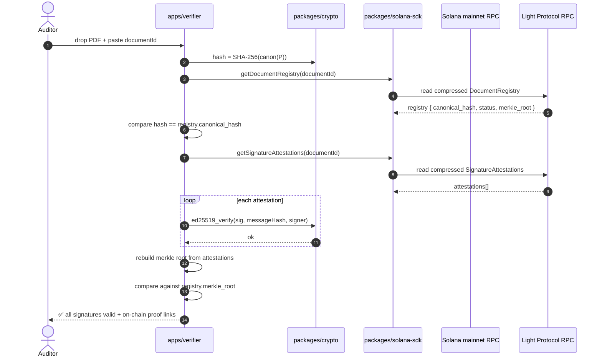

# Sequence — Public verification (no YourSign backend)

References AC-5.* in `docs/01-spec.md`.

## Notes

- **Zero YourSign backend in the path.** The verifier site is a static Next.js app fetching from public RPC.
- **CLI parity.** `packages/solana-sdk/bin/verify.ts` runs the exact same logic from a terminal, for offline auditors.
- **What if the document content was altered?** Step 5 fails, verifier reports `HASH_MISMATCH`.
- **What if a signature was forged?** Step 11 fails, verifier reports `BAD_SIGNATURE`.
- **What if an attestation was deleted on-chain?** Compressed accounts are append-only via Merkle tree updates — historical leaves remain provable.
